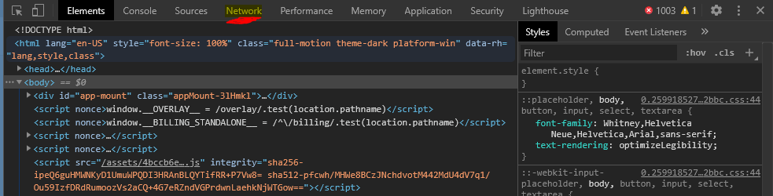
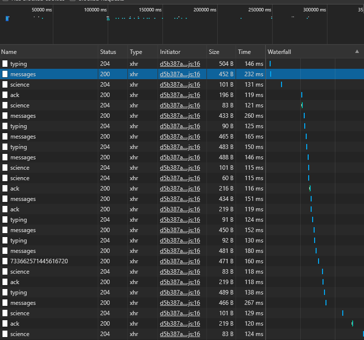
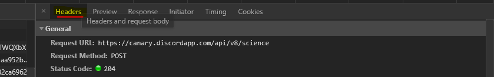
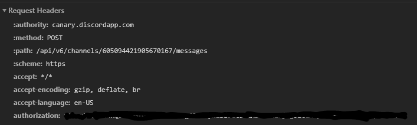
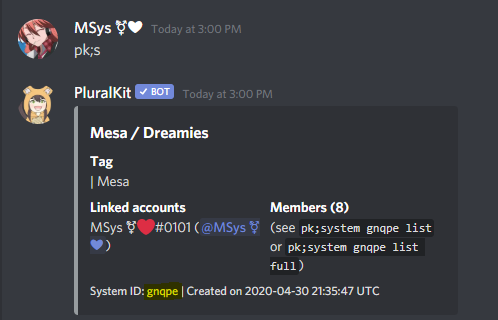

# PKSwitcher

This program is used to change the Discord Custom Status in order to display who is fronting. This program is based on PluralKit's API.

## How does it work?

Every 2 minutes, the program will send a request to the PluralKit API to check if someone is fronting (or if someone **else** than who is specified on the custom status is fronting) in order to change the custom status.

## What do I need to install?
You will need to install [NodeJS](https://nodejs.org). (either the Current version or the LTS version, it's up to you.). Then you'll be able to follow the instructions.

## How to configure it?

You will need your Discord token, you can only get it through a computer, so if you don't have Discord on a PC, sorry, this won't work for you.

In order to get the token, you will need to : 

1) Press Ctrl+Shift+I on Discord to show developer tools
2) Navigate to the Network tab

3) In Discord, send a message or join a voice channel.
4) You will see something like this

Click on anything (messages is the best.)
5) Navigate to the "Headers" tab

6) Scroll down and you'll see the "Authorization" object, like this:

Copy the token on the Authorization object and keep it for later.

***NEVER SHARE YOUR TOKEN WITH ANYBODY ELSE.***

7) We are almost finished. Now launch the `install.bat`.
8) Send a private message to PluralKit with the `pk;token` command. Copy the token PluralKit gave to you.
9) Still with PluralKit, do the `pk;s` command and copy the system ID at the bottom of the message.

10) Open the `config.json` file and insert your Discord token, your PluralKit token and your PluralKit system ID in it.
11) Simply launch it with `launch.bat` and change who is fronting on PluralKit. The custom status will change within 2 minutes.

If you have any questions about PKSwitcher, please contact us on:

Twitter: [@mesasys](https://www.twitter.com/mesasys)

Discord: MSys ⚧❤#0101
